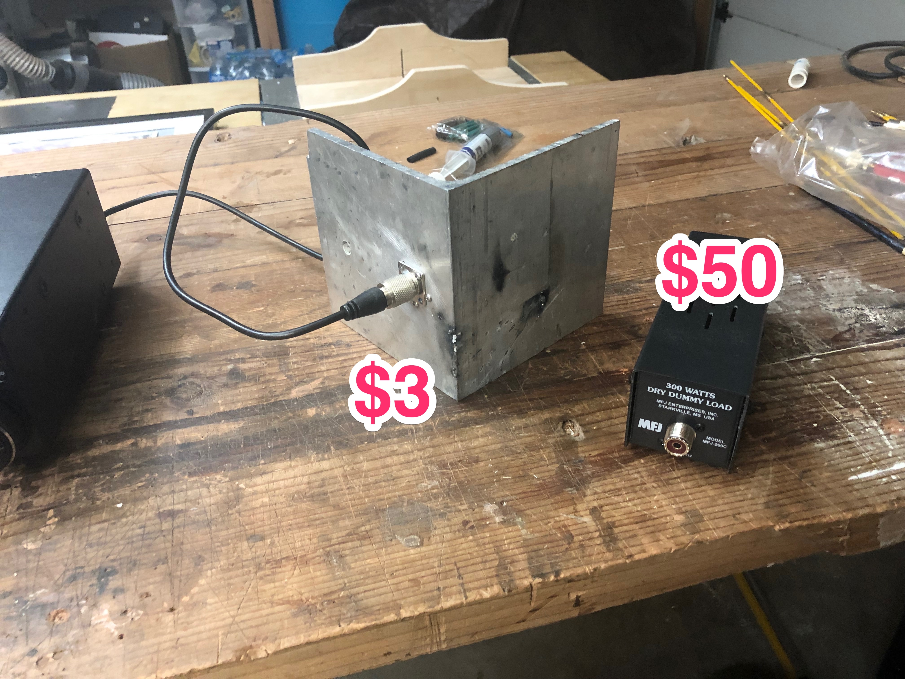
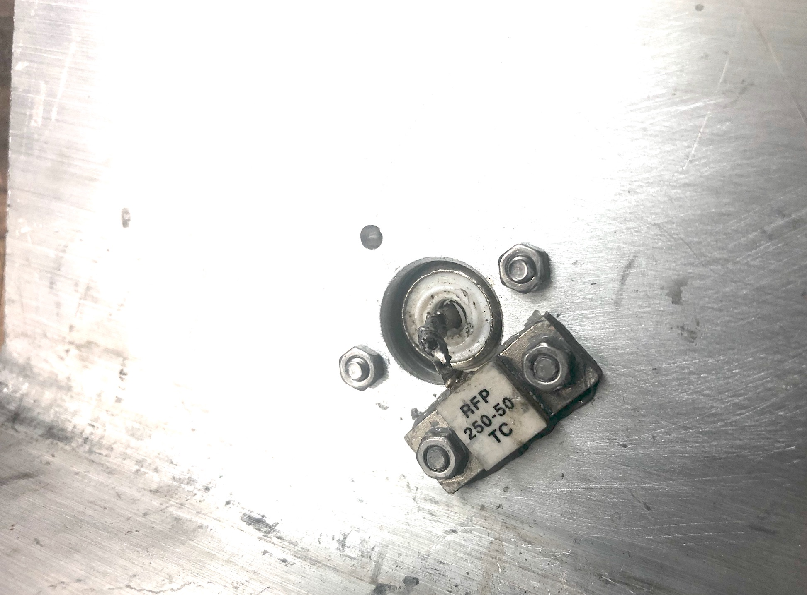
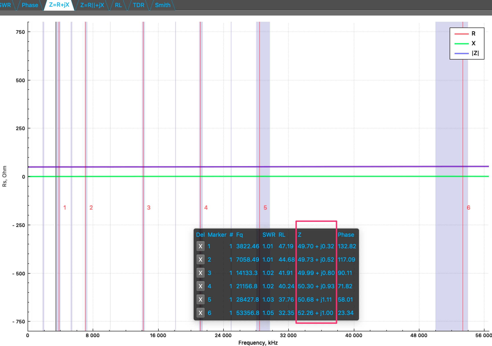
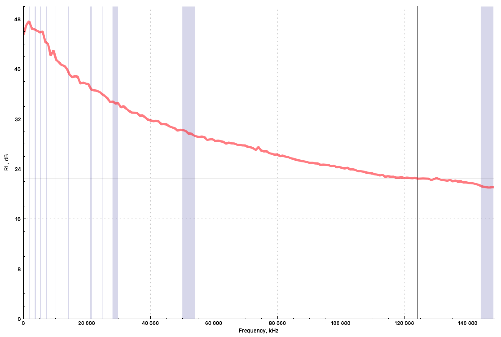

# $3 dummy load

It's made of RFP 250-50 RF metal film resistor that is rated to 250W and 1/4" aluminum angle ~10"x12".

This is how it looks from the back. Notice that the RF resistor is very close to the SO-239, did not want to introduce any unwanted reactance.

Here is what antenna analyzer shows

impedance 49.7 ... 52.3 Ohm on 3 ... 50Mhz range

## Return loss 
This is a measure of how well the load absorbs RF

return loss > 30dB 0-50MHz

## Power rating
100 Watts 2 minute max

In practice in 90 sec of applying 100w RTTY it gets hot. I can still touch it, around the chip, but not for very long. It's porbably gets to ~130F/55C in the center. Edges obviously remain cooler.
