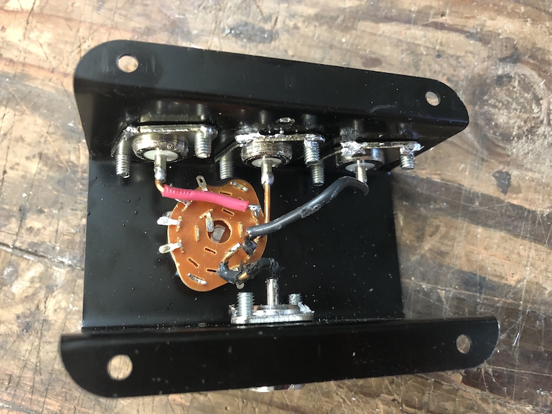

# Cheap RF Switch

Bought on Amazon https://www.amazon.com/gp/product/B01EADUJGC/

# Rewired 

Insertion loss ~0.15db, isolation on 40m is -50db, which is great! It gets progressively worse up to -25db at 2m band.

## Insertion loss

## Ports isolation

